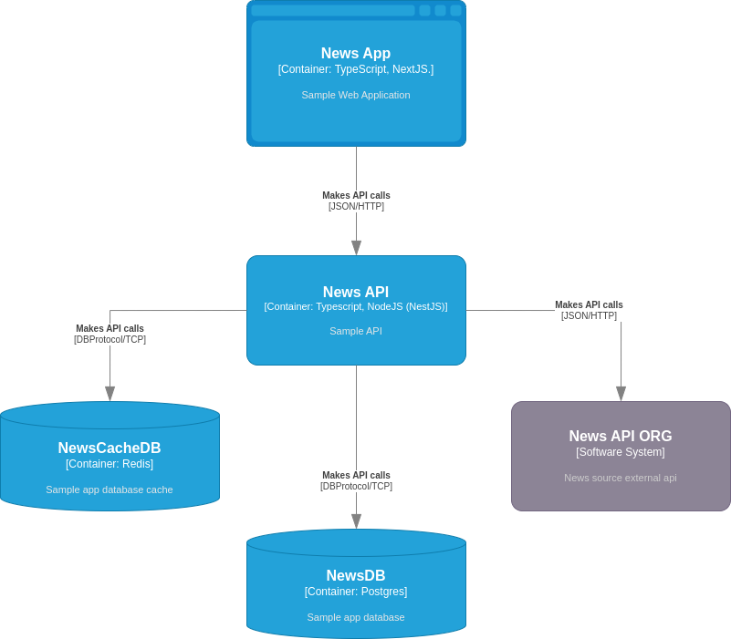

# News APP
###  This is a standard NextJS / NodeJS (NestJS) implementation of a client web application and its API, exposing features of the [NewsAPI](https://newsapi.org/).

#### Technogies

###### Front-End

- [NextJS](https://nextjs.org/)
- [Tailwind](https://tailwindcss.com/)

###### Back-End

- [NestJS](https://nestjs.com/)
- [PostgresSQL](https://www.postgresql.org/)
- [Redis](https://redis.io/)

#### Architecture

**C4 - Components**

